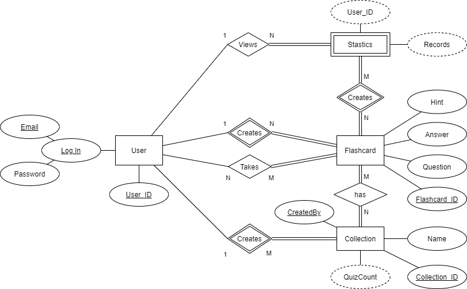
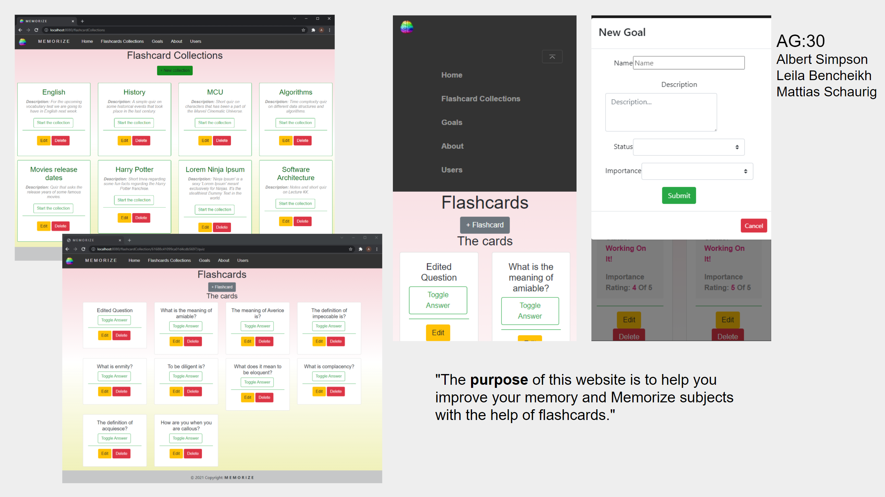

# Backend and Frontend Template

Latest version: https://git.ita.chalmers.se/courses/dit341/group-00-web (public Github [mirror](https://github.com/dit341/group-00-web))

## Project Structure

| File        | Purpose           | What you do?  |
| ------------- | ------------- | ----- |
| `server/` | Backend server code | All your server code |
| [server/README.md](server/README.md) | Everything about the server | **READ ME** carefully! |
| `client/` | Frontend client code | All your client code |
| [client/README.md](client/README.md) | Everything about the client | **READ ME** carefully! |
| [docs/DEPLOYMENT.md](docs/DEPLOYMENT.md) | Free online production deployment | Deploy your app online in production mode |
| [docs/LOCAL_DEPLOYMENT.md](docs/LOCAL_DEPLOYMENT.md) | Local production deployment | Deploy your app local in production mode |

## Requirements

The version numbers in brackets indicate the tested versions but feel free to use more recent versions.
You can also use alternative tools if you know how to configure them (e.g., Firefox instead of Chrome).

* [Git](https://git-scm.com/) (v2) => [installation instructions](https://www.atlassian.com/git/tutorials/install-git)
  * [Add your Git username and set your email](https://docs.gitlab.com/ce/gitlab-basics/start-using-git.html#add-your-git-username-and-set-your-email)
    * `git config --global user.name "YOUR_USERNAME"` => check `git config --global user.name`
    * `git config --global user.email "email@example.com"` => check `git config --global user.email`
  * > **Windows users**: We recommend to use the [Git Bash](https://www.atlassian.com/git/tutorials/git-bash) shell from your Git installation or the Bash shell from the [Windows Subsystem for Linux](https://docs.microsoft.com/en-us/windows/wsl/install-win10) to run all shell commands for this project.
* [Chalmers GitLab](https://git.ita.chalmers.se/) => Login with your **Chalmers CID** choosing "Sign in with" **Chalmers Login**. (contact [support@chalmers.se](mailto:support@chalmers.se) if you don't have one)
  * DIT341 course group: https://git.ita.chalmers.se/courses/dit341
  * [Setup SSH key with Gitlab](https://docs.gitlab.com/ee/ssh/)
    * Create an SSH key pair `ssh-keygen -t ed25519 -C "email@example.com"` (skip if you already have one)
    * Add your public SSH key to your Gitlab profile under https://git.ita.chalmers.se/profile/keys
    * Make sure the email you use to commit is registered under https://git.ita.chalmers.se/profile/emails
  * Checkout the [Backend-Frontend](https://git.ita.chalmers.se/courses/dit341/group-00-web) template `git clone git@git.ita.chalmers.se:courses/dit341/group-00-web.git`
* [Server Requirements](./server/README.md#Requirements)
* [Client Requirements](./client/README.md#Requirements)

## Getting started

```bash
# Clone repository
git clone git@git.ita.chalmers.se:courses/dit341/group-00-web.git

# Change into the directory
cd group-00-web

# Setup backend
cd server && npm install
npm run dev

# Setup frontend
cd client && npm install
npm run serve
```

> Check out the detailed instructions for [backend](./server/README.md) and [frontend](./client/README.md).

## Visual Studio Code (VSCode)

Open the `server` and `client` in separate VSCode workspaces or open the combined [backend-frontend.code-workspace](./backend-frontend.code-workspace). Otherwise, workspace-specific settings don't work properly.

## System Definition (MS0)

### Purpose

Are you preparing for a medical exam and keep forgetting terminologies 📚? Do you have the urge to learn a new language 🧏, geography 🗺️ or even super loooong boring poems 📜 to sound "Culivated" 🤔? Do you want to improve your memory capacity or are you simply curious about how much information your brain could store? this tool is our gift to you 😌!! (thank us later ! 😜 )

Studies has shown that rehearsing information is the best way to ensure that you will remember it, researchers have found that being tested on information is actually one of the best ways to improve recall and expand the memory capacity of the brain. Therefore, our solution is to create a platform for the improvement memory seekers to create an unlimited number of folders (collections) where they can create their custumised notes or flashcards in order to view them frequently.


### Pages

* Login page: Once on the website a login is requiered, e.i email address and a password, if the user already has a registerd account. Otherwise, a link to create a new account will be visible and redirects the user to create a new account page.
* Create new account page: The user fills the form with: a name, an email address, a password, apassword confirmation (test password match) and can submit the form by clicking on the submition button (register).

* Collections page - Once logged in, the user will be able to view menu of all the collections(folders), if already exist, the user can then freely update, add or delete a collection.

* Specific collection page: Once the user chooses a collection the flashcards will appear as a list in a miniature form. Once the user clicks on the start buttond, the digital flachcards will start showing up one by one on the users pace. The flashcard/note displays a writing such as a word or a sentence, or an image. The card is created by the user, so it will display whatever the user chose to view and in any language. The card also could display an optional field "hint". Once the user taps on the digital card, the card flips and displays the answer. The user could jump to the next card by clicking on "next".On the collection, The user can also make changes on a specific note, delete or add a new note.

Once the answer is displayed, the user will manually click on correct or not correct symbols or butons if she/he could respectively answer or not answer This information will be stored in the database for satistics purpose that will be revealed later.

The user will have the option either to go through the cards in the order or randomly. Moreover, the user can choose to only go through the card on which he/she spend more time to answer.

* Statistics page: The user will be able to track the improvement of how much time spent on the collection and a tip of how often the user should go through the collection to reach the ideal estimated time calculated by the system.

* Account page: The user can update information, change the password or delete the account.

### Entity-Relationship (ER) Diagram



## Teaser (MS3)


